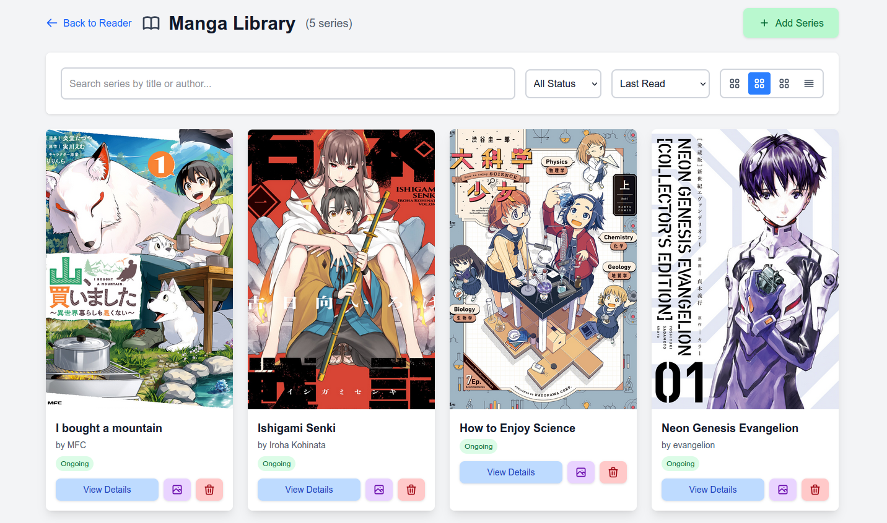
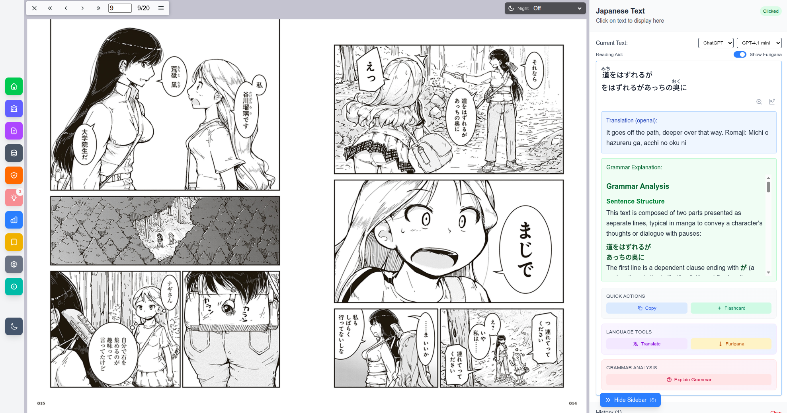
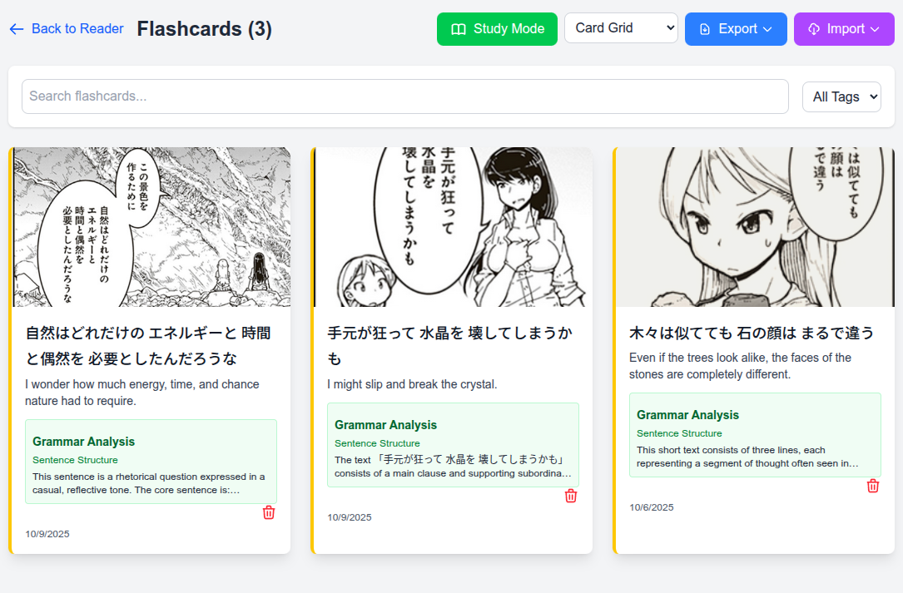

# Mokuro Reader Enhanced

A self-hosted, mokuro-based manga reader with enhanced features for Japanese language learners. Developed by [hanabira.org](https://hanabira.org).

**⚠️ Experimental Release:** This is an early version intended for early adopters. The application may contain bugs and incomplete features. Use at your own risk and expect potential issues.

**License:** MIT

**Legal Notice:** This application is designed for use with legally obtained manga only. Users are responsible for ensuring they have the legal right to use any manga content with this reader. Legal manga sources include [BookWalker.jp](https://bookwalker.jp/), physical books, and other authorized distributors.

## About

This reader uses [Mokuro](https://github.com/kha-white/mokuro) OCR manga files to provide an enhanced reading experience with features like text extraction, dictionary lookups, and SRS flashcards. 

**Important:** This is a self-hosted application that requires Docker to run. You need to prepare your manga files with Mokuro first (see [Mokuro's documentation](https://github.com/kha-white/mokuro) for OCR processing), then use this reader to view them.

## Quick Start

1. **Clone the repository**
   ```bash
   git clone https://github.com/tristcoil/hanabira.org_manga_reader.git
   cd hanabira.org_manga_reader
   ```

2. **Configure the application (to setup your DEEPL and OpenAI API keys for translations, you can leave they keys empty, the config just needs to exist)**
   ```bash
   cp config.py.example config.py
   ```

3. **Build and run with Docker**
   ```bash
   docker compose build
   docker compose up
   ```

4. **Access the application**
   - Frontend: http://localhost:3000 (use web browser)
   - Backend API: http://localhost:5000

## Screenshots

*Screenshots feature manga from [Ruri Rocks](https://bookwalker.jp/dee6c149f1-70c6-4580-8c7d-08949bee4758/) - available legally on BookWalker.jp*

### Landing Page

*Clean landing page with theme toggle and quick access to library and flashcards*

### Library View

*Organize and browse your manga collection with series and chapter management*

### Reading Interface

*Immersive reading experience with text sidebar for translations and dictionary lookups*


*Adaptive layout that works beautifully with different manga formats*

### Flashcard System

*Built-in SRS flashcard system for vocabulary learning while reading*

## Features

- **Split Layout**: Mokuro viewer (70%) + Text sidebar (30%)
- **Real-time Text Display**: Shows Japanese text when hovering over manga text
- **Click History**: Keep track of clicked text for easy reference
- **Copy to Clipboard**: One-click copying of Japanese text
- **Responsive Design**: Toggle sidebar visibility with button or 'S' key
- **Japanese Font Support**: Proper rendering of Japanese characters

## How to Use

1. **Hover**: Move your mouse over Japanese text in the manga to see it in the sidebar
2. **Click**: Click on text to add it to your history for later reference
3. **Copy**: Use the copy button to copy text to clipboard
4. **Toggle Sidebar**: Click the toggle button or press 'S' to show/hide the sidebar
5. **Clear History**: Use the clear button to remove all saved text entries

## Controls

- **Mouse Hover**: Display text temporarily
- **Mouse Click**: Save text to history
- **'S' Key**: Toggle sidebar visibility
- **Copy Buttons**: Copy individual text entries to clipboard

## Installation & Setup

1. Copy your mokuro files (`*.html`, images, `_ocr` folder) to the `public/` directory
2. Install dependencies: `npm install`
3. Start development server: `npm run dev`
4. Open http://localhost:3000 in your browser

## Technical Details

This application uses:
- **Next.js 15**: Modern React framework with TypeScript support
- **Tailwind CSS**: Utility-first CSS framework for styling
- **PostMessage API**: Communication between mokuro iframe and React app
- **Google Fonts**: Noto Sans JP for proper Japanese text rendering

### Data & Persistence Architecture

The frontend is now an **API-only client**. All persistence that previously happened via `localStorage` has been removed. The `ContentManager` in `src/lib/content.ts` acts strictly as a thin async facade over backend endpoints (or stubs where backend features are not yet implemented). Current status:

- Series, chapters, bookmarks: retrieved via async methods (ready for backend wiring)
- Reading progress, sessions, analytics: placeholder implementations returning defaults and logging a warning
- Import/export & SRS features: reserved for future backend implementations

This design ensures no silent divergence between frontend state and backend truth. When a real endpoint is implemented, only the corresponding method in `ContentManager` needs updating.

### Adding Backend Integrations

1. Implement the endpoint in the backend service
2. Update the matching method in `ContentManager`
3. (Optional) Add lightweight integration tests once testing framework is adopted

Until endpoints exist, UI components handle missing data gracefully (loading states, zeroed stats). 

## File Structure

```
src/
├── app/
│   ├── page.tsx          # Main page component
│   ├── layout.tsx        # Root layout with metadata
│   └── globals.css       # Global styles and Japanese fonts
├── components/
│   ├── MainLayout.tsx    # Main layout with sidebar toggle
│   ├── MokuroViewer.tsx  # Iframe wrapper for mokuro HTML
│   └── TextSidebar.tsx   # Sidebar component for text display
└── public/
    ├── test.html         # Modified mokuro HTML file
    ├── test/             # Manga images
    └── _ocr/             # OCR data files
```

## Customization

You can customize the appearance by modifying:
- Sidebar width in `MainLayout.tsx`
- Colors and fonts in `globals.css`
- Text display behavior in `TextSidebar.tsx`

## Getting Started

```bash
npm run dev
# or
yarn dev
# or
pnpm dev
```

Open [http://localhost:3000](http://localhost:3000) with your browser to see the result.

## License

This project enhances the original mokuro functionality. Please respect the original mokuro project's license terms.

## SRS Diagnostics & Analytics

To troubleshoot spaced repetition issues (e.g., a reviewed card still appearing as due), use the backend diagnostics script.

Run from repository root:

```bash
python backend/scripts/srs_diagnostics.py --api http://localhost:5000 --db-path backend/data/flashcards.db
```

Reports include:
- Interval / ease / repetition distributions
- Recomputed due cards (DB) vs `/srs/due` endpoint
- Orphan review rows (no matching flashcard)
- Stale rows (last_review > next_review) or negative intervals
- Ease factor out-of-bounds
- Recent review sample (top 10 by last_review)
- Summary with critical errors (non‑zero exit) and warnings

Workflow suggestion:
1. Run diagnostics (baseline)
2. Perform a review in the UI
3. Re-run diagnostics; the reviewed card should drop out of due (unless marked Again)
4. Investigate discrepancies: if only API shows it, inspect backend upsert timing/cache

Integrate into CI by failing the build if critical errors are reported.
